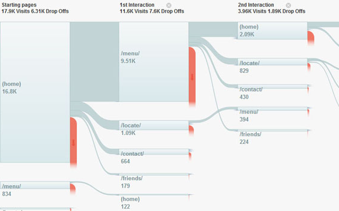

Il y a quelques débats ces temps-ci sur l'évolution des logiciels de prototypage et sur ce que serait l'outil parfait (exemples d'articles : [1](http://grafiskjournal.com/archive/envisioning-the-perfect-design-app), [2](https://medium.com/startup-study-group/designer-desperately-looking-for-scalability-design-tools-f04478a12d42#.w49saisuc), [3](http://www.subtraction.com/2015/05/07/the-state-of-design-tools/). Avant même de s'interroger sur le logiciel lui-même, un angle intéressant -- et souvent implicite dans les discussions -- est de distinguer deux styles de flux de travail : le style de l'IDE et celui d'UNIX.

\[caption id="attachment\_1606" align="alignnone" width="625"\] Un exemple volontairement caricatural : Visual Studio avec plein de panneaux activés\[/caption\]

En informatique, un IDE est un Environnement de Développement intégré (_Integrated Development Environnement_), c'est-à-dire un gros logiciel auto-suffisant qui rassemble l'ensemble des fonctions nécessaires à tous les aspects du développement : code proprement dit, mais aussi navigation dans le projet, gestion des dépendances, des versions, des tests, des générations etc.

Dans le monde de la conception, il n'y a pas de logiciel promettant de mener un gros projet de bout en bout, sans doute à cause de la grande variété des besoins, mais il y a quand même des offres se voulant très larges. Je pense à [iRise](http://www.irise.com/), qui permet de maintenir un répertoire d'exigences ou de cas d'utilisation, de les relier à des schémas de navigation et à des maquettes, le tout dans une interface unique. Citons aussi [Axure](HTTP://Axure.com), qui permet de faire des maquettes interactives et visuellement détaillées, de générer une spécification, de les versionner et de les partager en ligne.

L'avantage de l'IDE, c'est que normalement tout marche facilement puisque l'intégration est pensée et garantie par les créateurs. J'y vois deux inconvénients principaux : \* Il doit couvrir tous les cas d'utilisation possibles et donc devient facilement une usine à gaz. \* La dépendance à l'IDE est forte, puisqu'en cas de bascule le nouvel outil doit être aussi polyvalent et couvrir toute la chaîne de travail.

Passons à la [philosophie UNIX](http://www.catb.org/esr/writings/taoup/html/ch01s06.html). Un de ses principes est de se limiter à des outils simples et de les faire communiquer entre eux. Par exemple, dans un terminal, une première commande recherche les photos d'un dossier et passe le résultat à une seconde qui les renomme, avant qu'une troisième commande les redimensionne. J'y vois un analogue avec le flux en vogue actuellement, Sketch ==> Dropbox ==> Invision : un outil pour la réalisation d'interface (et créé spécifiquement pour ça), un deuxième pour le partage, un troisième pour l'interactivité. L'analogie n'est pas parfaite, puisqu'Invision sert à la fois pour les interactions et pour la discussion.

L'avantage du style UNIX, c'est la souplesse. Le risque, c'est l'inexistence de formats partagés, surtout que le monde fonctionne de manière largement propriétaire. Il y a des standards de fait, comme le PSD, et dont Adobe publie une documentation. Mais cette documentation est incomplète et rarement mise à jour ([source](https://github.com/layervault/psd.rb/wiki/Anatomy-of-a-PSD-File).

### Quelques idées

Quelque soit le style qui a votre préférence, l'intégration entre les différences phases d'un projet pourrait être beaucoup plus poussée, notamment entre la conception, l'évaluation et les itérations. Plus concrètement :

A ma connaissance, aucun logiciel de test n'enregistre les interactions de l'utilisateur et leurs contextes, même les mastodontes comme Morae ou Ovo, un peu comme les services de marketing web qui proposent d'enregistrer le parcours de l'utilisateur et des évènements personnalisés (tel clic, telle visite de telle partie de page, etc.). L'intérêt serait de savoir qu'à tel moment, il a cliqué sur tel bouton dans telle vue et a prononcé telle parole, et que j'ai noté tel commentaire.

\[caption id="attachment\_1607" align="alignnone" width="565"\] Exemple : Google Analytics\[/caption\]

Ensuite, il faudrait une intégration avec un système de suivi : je crée un ticket pour demander aux développeurs ou aux concepteurs de corriger un problème d'utilisabilité, en référant aux différents moments observés, et tout le monde peut aller voir le bout d'interface en question et le comportement de l'utilisateur.
