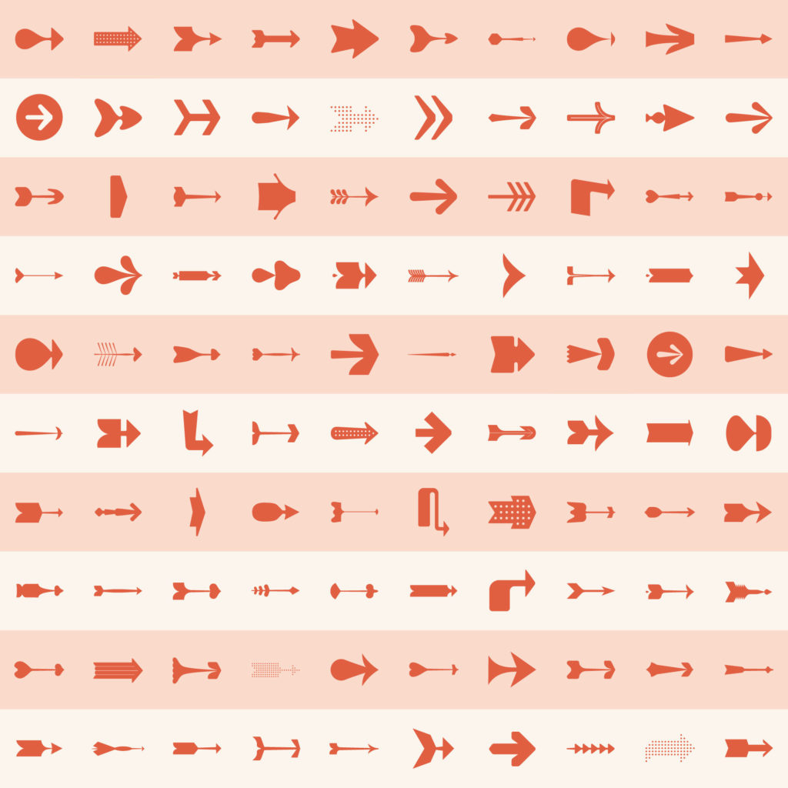

---
draft:true
title: "Flèches, partie 1"
date: ""

J'ai une envie de créer un programme générant des flèches.

La flèche est un symbole intéressant car il est à la fois bien identifié et très variable.

Il y a le symbole de l'objet, avec la pointe, la hampe et l'empennage :

Il y a le symbole de direction, sans l'empennage. Il est même présent dans une norme ISO :

Et après tout, le chevron est utilisé avec le même sens, comme une flèche réduite à sa pointe :

A partir de là, tout est permis dans la variété des formes :

En plus d'être identifiable et très variable, ce qui va être intéressant et compliqué c'est qu'une flèche est de base très modulaire (les différentes parties sont séparées) et devient plus organique quand l'artiste apporte sa patte, avec des courbes entre chaque partie.
