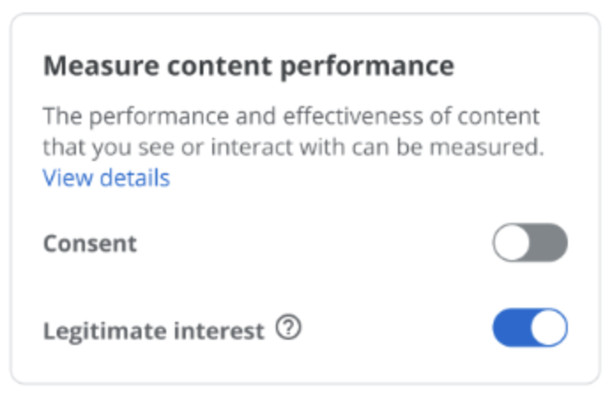

Pour recueillir une info auprès de quelqu'un, il faut une base légale :  accord de la personne, obligation légale, nécessité pour remplir un  service (pour se faire livrer il faut donner son adresse)... ou encore  un intérêt légitime.

 [La Cnil l'explique bien ici.](https://www.cnil.fr/fr/les-bases-legales)

En gros, si une entreprise a un objectif commercial dont elle peut justifier le caractère précis et licite, que pour accomplir cet objectif elle a besoin d'une information, que  ce besoin est proportionné et nécessaire (c'est-à-dire qu'elle ne peut pas faire autrement, alors elle peut recueillir cette information sans demander le consentement de l'utilisateur.

[Détails ici, encore chez la CNIL](https://www.cnil.fr/fr/linteret-legitime-comment-fonder-un-traitement-sur-cette-base-legale) [cnil.fr/fr/linteret-le…](https://www.cnil.fr/fr/linteret-legitime-comment-fonder-un-traitement-sur-cette-base-legale)

Dans les politiques de confidentialité des sites, ça donne des liste de  données recueillie avec des enchainements de "intérêt légitime" comme  base légale, sans plus de détail. Je ne sais pas si les juristes attendaient d'y voir plus plus clair, mais j'ai l'impression que c'était un recours beaucoup moins fréquent juste après la mise en place du RGPD.

Première complication : il faut croiser cette base légale avec le principe  d'opposition : le visiteur peut quand même t'opposer à cette récolte.

##  Un moyen pour rendre les popins encore plus imbuvables

Certains  sites incluent même des case à cocher, sélectionnées par défaut. a donne des trucs délirants où l'intérêt légitime devient dans une  espèce de consentement dédoublé, mais en opt-out et plus ou moins  planqué. Pour chaque type d'info, est-ce que je consens au recueil et/ou est-ce que je m'y oppose ?

Techniquement tu pourrais faire les deux et faire bugger la matrice.

C'est une conception totalement scolaire du droit où on  imbrique chaque pièce sans souci de la logique d'ensemble, pour aboutir à une usine à gaz. On pourrait presque croire que c'est une forme de grève du zèle pour rendre les popins encore plus imbuvables.

## Un dark pattern

Ca peut aller plus loin et devenir un dark pattern total. Par exemple ici vous pouvez cliquer sur "manage cookies", arriver sur une liste et tout refuser. Sauf que vous  pouvez aussi cliquer sur le minus "right to object" et arriver sur une  liste d'infos quasi-identiques, cette fois cochée par défaut. 

Donc vous pouvez "reject all" la liste dans ce screenshot, au titre du  consentement, sans savoir si ça influence à la liste pour l'intérêt  légitime. On suppose que non. D'ailleurs depuis cette vue, pas moyen de  retourner à la vue principale pour aller voir l'intérêt légitime.

## Une pratique de toute façon pas légale

On ne contourne pas le RGPD si facilement. Tout bêtement :

> Les bases légales ne peuvent être cumulées pour une même finalité. Un même traitement de données peut poursuivre plusieurs finalités, c’est-à-dire plusieurs objectifs, et une base légale devra alors être définie pour chacune d'elles.
>
> -- [source](https://www.cnil.fr/fr/prendre-en-compte-les-bases-legales-dans-limplementation-technique)

C'est assez logique. Une même donnée peut servir à plusieurs choses,  mais XXX

Source de la citation [cnil.fr/fr/prendre-en-…](https://www.cnil.fr/fr/prendre-en-compte-les-bases-legales-dans-limplementation-technique)

Notez que la confusion entretenue entre consentement et intérêt légitime fut un des motifs retenus par le conseil d'état pour [coller 50M€ d'amende à Google](https://www.legifrance.gouv.fr/cnil/id/CNILTEXT000038032552/).
